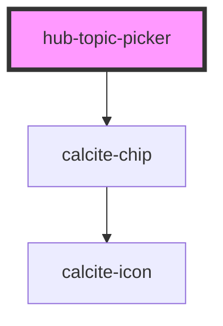

# hub-topic-picker

<!-- Auto Generated Below -->

## Properties

| Property          | Attribute         | Description                                        | Type       | Default                                                   |
| ----------------- | ----------------- | -------------------------------------------------- | ---------- | --------------------------------------------------------- |
| `allowSelection`  | `allow-selection` | Option to allow for selected & de-selecting topics | `boolean`  | `true`                                                    |
| `options`         | `options`         |                                                    | `string`   | `undefined`                                               |
| `topicsAvailable` | --                | Array of topics to be displayed                    | `string[]` | `['education', 'health', 'recreation', 'transportation']` |
| `topicsSelected`  | --                | Array of topics that are current selected          | `string[]` | `[]`                                                      |
| `values`          | `values`          |                                                    | `string`   | `undefined`                                               |

## Events

| Event           | Description                                       | Type                    |
| --------------- | ------------------------------------------------- | ----------------------- |
| `editorUpdated` |                                                   | `CustomEvent<any>`      |
| `topicsChanged` | Event sent after any or all topics updated        | `CustomEvent<ITopic[]>` |
| `topicSelected` | Event sent when a topic is selected or deselected | `CustomEvent<ITopic>`   |

## Dependencies

### Depends on

- calcite-chip

### Graph

----------------------------------------------

*Built with [StencilJS](https://stenciljs.com/)*
