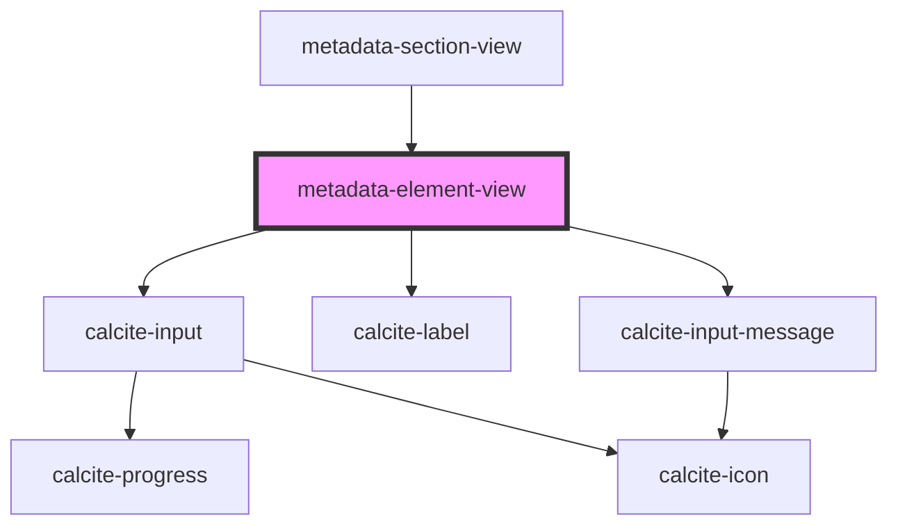

# metadata-element-view

<!-- Auto Generated Below -->

## Properties

| Property      | Attribute     | Description | Type                                                                                                                                                                                   | Default          |
| ------------- | ------------- | ----------- | -------------------------------------------------------------------------------------------------------------------------------------------------------------------------------------- | ---------------- |
| `description` | `description` |             | `string`                                                                                                                                                                               | `""`             |
| `id`          | `id`          |             | `string`                                                                                                                                                                               | `"title"`        |
| `required`    | `required`    |             | `boolean`                                                                                                                                                                              | `false`          |
| `subtype`     | `subtype`     |             | `string`                                                                                                                                                                               | `null`           |
| `title`       | `title`       |             | `string`                                                                                                                                                                               | `"Input: Title"` |
| `type`        | `type`        |             | `"color" \| "date" \| "datetime-local" \| "email" \| "file" \| "image" \| "month" \| "number" \| "password" \| "search" \| "tel" \| "text" \| "textarea" \| "time" \| "url" \| "week"` | `"text"`         |
| `value`       | `value`       |             | `string`                                                                                                                                                                               | `""`             |

## Dependencies

### Used by

 - [metadata-section-view](../metadata-section-view)

### Depends on

- calcite-input
- calcite-label
- calcite-input-message

### Graph

----------------------------------------------

*Built with [StencilJS](https://stenciljs.com/)*
