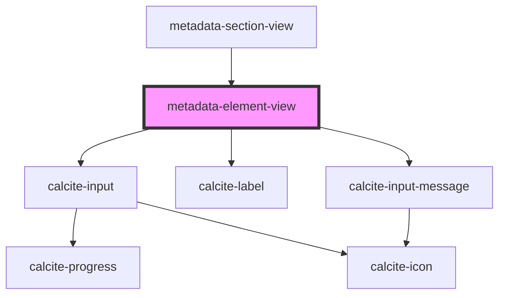

# metadata-element-view

<!-- Auto Generated Below -->

## Properties

| Property       | Attribute       | Description                                                                                                               | Type                                                                                                                                                                                   | Default          |
| -------------- | --------------- | ------------------------------------------------------------------------------------------------------------------------- | -------------------------------------------------------------------------------------------------------------------------------------------------------------------------------------- | ---------------- |
| `description`  | `description`   |                                                                                                                           | `string`                                                                                                                                                                               | `""`             |
| `elementId`    | `element-id`    |                                                                                                                           | `string`                                                                                                                                                                               | `"title"`        |
| `elementTitle` | `element-title` |                                                                                                                           | `string`                                                                                                                                                                               | `"Input: Title"` |
| `required`     | `required`      |                                                                                                                           | `boolean`                                                                                                                                                                              | `false`          |
| `schema`       | --              | JSON schema definition for a specific metadata property see https://json-schema.org/understanding-json-schema/basics.html | `object`                                                                                                                                                                               | `undefined`      |
| `subtype`      | `subtype`       | Subtype is used to override the metadata editor for this element e.g. `geography` or `topics` show specific editors       | `string`                                                                                                                                                                               | `null`           |
| `translator`   | `translator`    | Which translator to use from the schema definition                                                                        | `string`                                                                                                                                                                               | `"arcgis"`       |
| `type`         | `type`          | Currently based on calcite-components input                                                                               | `"color" \| "date" \| "datetime-local" \| "email" \| "file" \| "image" \| "month" \| "number" \| "password" \| "search" \| "tel" \| "text" \| "textarea" \| "time" \| "url" \| "week"` | `"text"`         |
| `value`        | `value`         |                                                                                                                           | `string`                                                                                                                                                                               | `""`             |

## Events

| Event            | Description | Type               |
| ---------------- | ----------- | ------------------ |
| `elementUpdated` |             | `CustomEvent<any>` |

## Dependencies

### Used by

 - [metadata-section-view](../metadata-section-view)

### Depends on

- calcite-input
- calcite-label
- calcite-input-message

### Graph

----------------------------------------------

*Built with [StencilJS](https://stenciljs.com/)*
