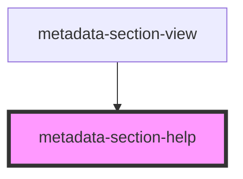

# metadata-section-help

<!-- Auto Generated Below -->

## Properties

| Property      | Attribute     | Description | Type     | Default                                                                                 |
| ------------- | ------------- | ----------- | -------- | --------------------------------------------------------------------------------------- |
| `description` | `description` |             | `string` | `"This information is used in search results, gallery cards and on the details views."` |
| `title`       | `title`       |             | `string` | `"Basic Info"`                                                                          |

## Dependencies

### Used by

 - [metadata-section-view](../metadata-section-view)

### Graph

----------------------------------------------

*Built with [StencilJS](https://stenciljs.com/)*
