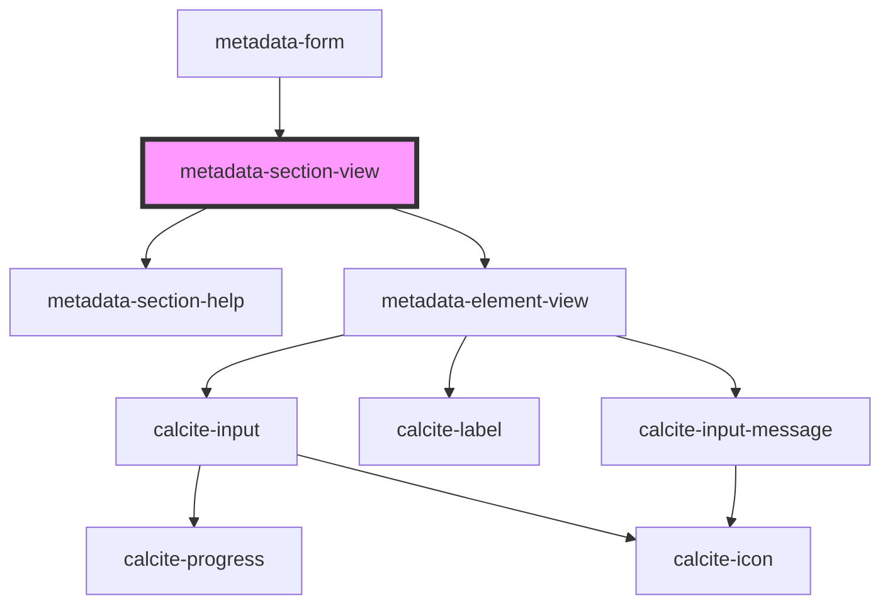

# metadata-section-view

<!-- Auto Generated Below -->

## Properties

| Property       | Attribute       | Description                                        | Type           | Default    |
| -------------- | --------------- | -------------------------------------------------- | -------------- | ---------- |
| `description`  | `description`   |                                                    | `string`       | `""`       |
| `elementTitle` | `element-title` |                                                    | `string`       | `""`       |
| `inputs`       | --              | JSON Schema Properties section                     | `any[]`        | `[]`       |
| `locale`       | `locale`        |                                                    | `string`       | `"en"`     |
| `resource`     | --              | Hub Resource object.                               | `IHubResource` | `null`     |
| `spec`         | `spec`          |                                                    | `string`       | `"arcgis"` |
| `translator`   | `translator`    | Which translator to use from the schema definition | `string`       | `"arcgis"` |

## Events

| Event             | Description | Type               |
| ----------------- | ----------- | ------------------ |
| `resourceUpdated` |             | `CustomEvent<any>` |

## Dependencies

### Used by

 - [metadata-form](../../blocks/metadata-form)

### Depends on

- [metadata-section-help](../metadata-section-help)
- [metadata-element-view](../metadata-element-view)

### Graph

----------------------------------------------

*Built with [StencilJS](https://stenciljs.com/)*
