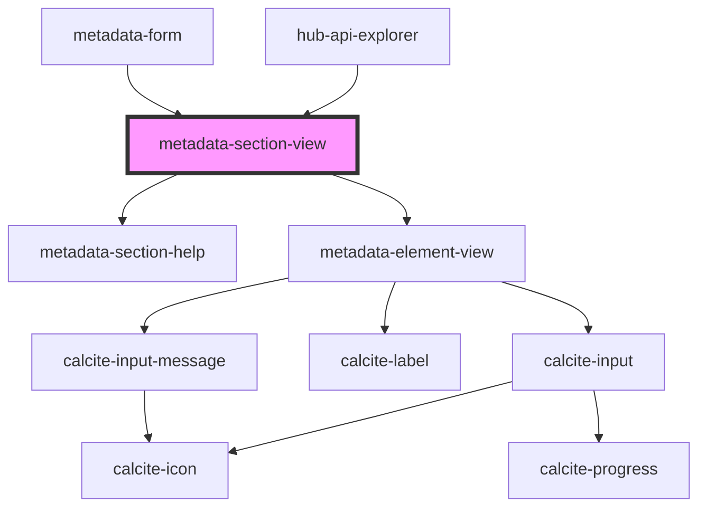

# metadata-section-view

narrative:
- `/:resource/:id/edit` - calls `elements:[IEditor] = getSchema(:resource)` and `resource:IHubResource = getResource(:id)`
- Template renders `forEach(elements as Element) { <md-editor type=element.type value=resource[element.translation] .../> }`
- Types can be simple: `text` `date` `array<string>` etc. and includes validations/requirements and use simple editor components
- Types can be custom: `license` `boundary` `attribute` that can be specialized editor components (e.g. “<boundary-picker>“)
- when the form is saved, the collection is sent back to `updateResource(values:IHubResource)` 
- and inside `updateResource()` it delegates to the specific type, e.g. `updateContent()`  or `updateMember()` which translates the Resource values into the portal specific values (e.g. `content.boundary -> sharing/content/items/:id/resources/boundary.json`

with this mechanism, validation and translation occurs within Hub.js - which itself provides a domain interface
Editors are components that are dynamically loaded 

<!-- Auto Generated Below -->

## Properties

| Property       | Attribute       | Description                                        | Type     | Default     |
| -------------- | --------------- | -------------------------------------------------- | -------- | ----------- |
| `description`  | `description`   |                                                    | `string` | `""`        |
| `elementTitle` | `element-title` |                                                    | `string` | `""`        |
| `inputs`       | --              | JSON Schema Properties section                     | `any[]`  | `[]`        |
| `locale`       | `locale`        |                                                    | `string` | `"en"`      |
| `resource`     | `resource`      | Hub Resource object.                               | `any`    | `null`      |
| `schema`       | `schema`        |                                                    | `any`    | `undefined` |
| `spec`         | `spec`          |                                                    | `string` | `null`      |
| `translator`   | `translator`    | Which translator to use from the schema definition | `string` | `"arcgis"`  |

## Events

| Event             | Description | Type               |
| ----------------- | ----------- | ------------------ |
| `resourceUpdated` |             | `CustomEvent<any>` |

## Dependencies

### Used by

 - [hub-api-explorer](../../containers/hub-api-explorer)
 - [metadata-form](../../blocks/metadata-form)

### Depends on

- [metadata-section-help](../metadata-section-help)
- [metadata-element-view](../metadata-element-view)

### Graph

----------------------------------------------

*Built with [StencilJS](https://stenciljs.com/)*
