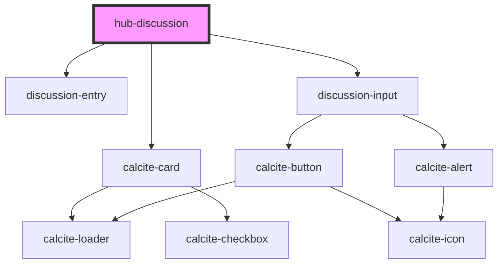

# hub-discussion

## TODO

- Add options to create new annotation layers
- Hub-wide, or per team / event
- How to migrate older services?
- Target should be `item:id:4ef` or other, not Featureservice URL

<!-- Auto Generated Below -->

## Properties

| Property         | Attribute         | Description                            | Type      | Default     |
| ---------------- | ----------------- | -------------------------------------- | --------- | ----------- |
| `allowReply`     | `allow-reply`     |                                        | `boolean` | `true`      |
| `annotationsUrl` | `annotations-url` |                                        | `string`  | `undefined` |
| `author`         | `author`          |                                        | `string`  | `undefined` |
| `org`            | `org`             |                                        | `string`  | `undefined` |
| `portalUrl`      | `portal-url`      |                                        | `string`  | `undefined` |
| `search`         | `search`          |                                        | `string`  | `undefined` |
| `session`        | `session`         | Serialized authentication information. | `string`  | `undefined` |
| `target`         | `target`          |                                        | `string`  | `undefined` |
| `update`         | `update`          |                                        | `boolean` | `undefined` |

## Events

| Event         | Description | Type               |
| ------------- | ----------- | ------------------ |
| `newResponse` |             | `CustomEvent<any>` |

## Dependencies

### Depends on

- calcite-card
- [discussion-entry](../../elements/discussion-entry)
- [discussion-input](../../blocks/discussion-input)

### Graph

----------------------------------------------

*Built with [StencilJS](https://stenciljs.com/)*
