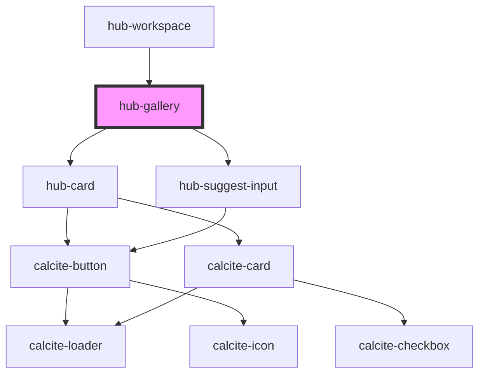

# hub-gallery

```
<hub-gallery 
  hubtype="content"
  limit="12"
  sort="modified"
  ></hub-gallery>
```

<!-- Auto Generated Below -->


## Properties

| Property            | Attribute           | Description                                      | Type                                | Default                    |
| ------------------- | ------------------- | ------------------------------------------------ | ----------------------------------- | -------------------------- |
| `buttontext`        | `buttontext`        | Text to show in the button                       | `string`                            | `"Explore"`                |
| `clientid`          | `clientid`          |                                                  | `string`                            | `"WXC842NRBVB6NZ2r"`       |
| `groups`            | `groups`            | Groups to limit search                           | `string`                            | `null`                     |
| `hubapi`            | `hubapi`            | Use the Hub API (true) or the Portal API (false) | `boolean`                           | `false`                    |
| `hubtype`           | `hubtype`           | Which Resources to search                        | `"content" \| "members" \| "teams"` | `"content"`                |
| `layout`            | `layout`            | Hub site URL to scope for search                 | `"horizontal" \| "vertical"`        | `"horizontal"`             |
| `limit`             | `limit`             | Maximum number of results to return              | `number`                            | `12`                       |
| `portal`            | `portal`            |                                                  | `string`                            | `"https://www.arcgis.com"` |
| `query`             | `query`             | Default Query                                    | `string`                            | `""`                       |
| `searchbutton`      | `searchbutton`      | Search Button text                               | `string`                            | `"Start Search"`           |
| `searchplaceholder` | `searchplaceholder` | Search placeholder text                          | `string`                            | `"Search for content"`     |
| `session`           | `session`           |                                                  | `string`                            | `null`                     |
| `showsearch`        | `showsearch`        | Choose to show or hide search                    | `boolean`                           | `true`                     |
| `site`              | `site`              | Hub site URL to scope for search                 | `string`                            | `null`                     |
| `sort`              | `sort`              | Default sort order                               | `"modified" \| "name"`              | `"name"`                   |


## Dependencies

### Used by

 - [hub-workspace](../hub-workspace)

### Depends on

- [hub-card](../../elements/hub-card)
- [hub-suggest-input](../../elements/hub-suggest-input)

### Graph


----------------------------------------------

*Built with [StencilJS](https://stenciljs.com/)*
